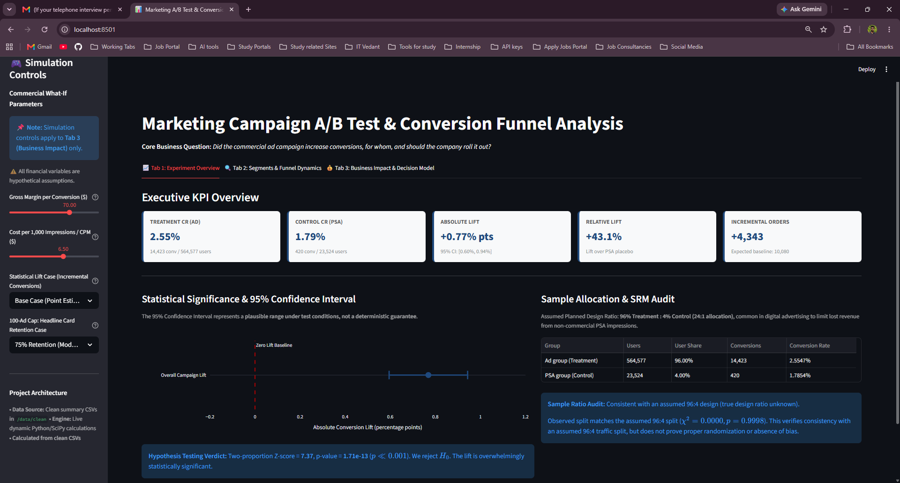
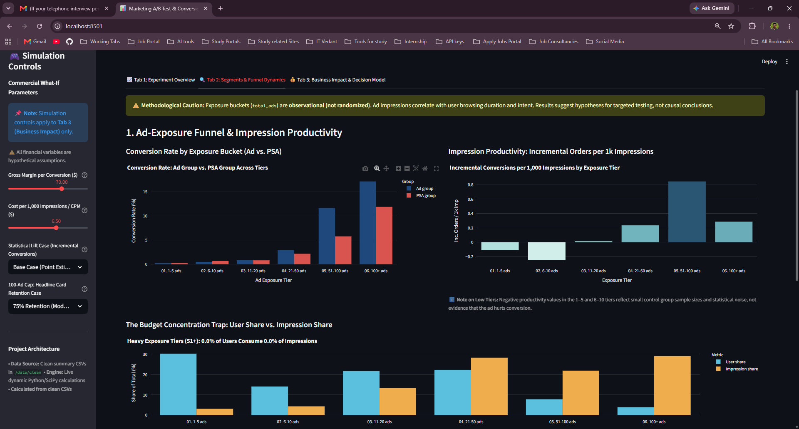
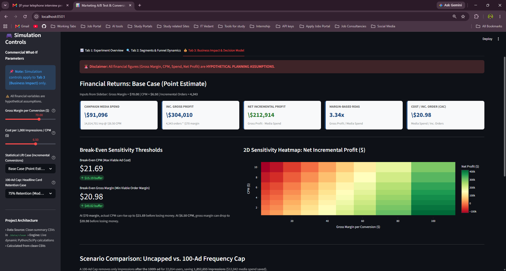

# Marketing Campaign A/B Test and Conversion Funnel Analysis

> A/B test analysis of a 588k-user marketing campaign: significance testing, exposure and timing segmentation, and a hypothetical profit model, with a live Streamlit app.

[](https://marketing-ab-test-analysis.streamlit.app/)
[](https://www.python.org/)
[](LICENSE)
[](tests/test_numbers.py)

---

## 🎯 Executive Business Question
> **"Did the commercial ad campaign increase conversions, for whom, and should the business roll it out?"**

This project investigates the estimated lift, assuming random assignment (per the dataset description; not independently verified), of a digital advertising campaign over an active placebo (Public Service Announcement), identifies behavioral saturation tiers across ad exposure, and translates statistical findings into an actionable financial decision framework under explicit commercial assumptions.

---

## 🌐 Live Interactive Dashboard & Visuals

Experience the live 3-tab dashboard deployed on Streamlit Community Cloud:  
👉 **[Launch Live Interactive Dashboard](https://marketing-ab-test-analysis.streamlit.app/)**

### Dashboard Previews

#### Tab 1: Experiment Overview & Statistical Significance


#### Tab 2: Exposure Funnel Dynamics & Temporal Segmentation


#### Tab 3: Business Impact & Scenario Modeling (Hypothetical Economics)


*(Note: The repository also includes a comprehensive [Power BI Design Specification](docs/powerbi_dashboard_specification.md) providing visual wireframes and copy-paste DAX formulas for desktop implementation).*

---

## 📊 Dataset & Integrity Audits
- **Source**: [Kaggle: Marketing A/B Testing Dataset by Favio Vázquez](https://www.kaggle.com/datasets/faviovaz/marketing-ab-testing) *(raw CSV excluded from git tracking per best practices)*.
- **Population**: 588,101 unique users (0 duplicates, 0 missing values).
- **Control Design**: The control group received Public Service Announcements (PSAs) rather than no ads, isolating creative content impact from ad placement availability.
- **Sample Allocation Audit**:
  - Treatment (`ad`): 564,577 users (96.00%)
  - Control (`psa`): 23,524 users (4.00%)
  - Chi-Square Goodness-of-Fit against the assumed 96:4 design ratio yielded $\chi^2 = 0.0000$, $p = 0.9998$. This confirms the observed sample closely aligns with the assumed 96:4 design ratio, but does not prove proper randomization.

---

## 🔬 Methodology
1. **Hypothesis Testing**: Two-proportion pooled z-test evaluated at $\alpha = 0.05$.
2. **Plausible Effect Bounds**: Wald two-proportion unpooled 95% Confidence Intervals for absolute and relative lift.
3. **Multiple Testing Correction**: Bonferroni adjustment ($\alpha / 7 = 0.0071$) applied across day-of-week subgroup analyses to control the Family-Wise Error Rate.
4. **Funnel Productivity Modeling**: Segmented users into exposure buckets (1–5, 6–10, 11–20, 21–50, 51–100, 100+ ads) to calculate incremental conversions per 1,000 impressions served.
5. **Sensitivity Decision Modeling**: 2D sensitivity matrix across gross margin ($5 to $100) and CPM ($1 to $10), calculating break-even CPM and break-even margin thresholds.

---

## 📈 Key Results

| Metric | Treatment (`ad`) | Control (`psa`) | Difference / Causal Lift | Statistical Assessment |
| :--- | :--- | :--- | :--- | :--- |
| **User Count** | 564,577 (96.0%) | 23,524 (4.0%) | — | Assumed 96:4 ratio ($\chi^2 = 0.0000$, $p = 0.9998$) |
| **Conversion Rate (CR)** | **2.5547%** (14,423 conv) | **1.7854%** (420 conv) | **+0.7692% pts** | $Z = 7.37$, $p = 1.71 \times 10^{-13}$ (Reject $H_0$) |
| **Relative Lift** | — | — | **+43.09%** | 95% CI: [+33.33%, +52.84%] |
| **Absolute Lift 95% CI** | — | — | **[+0.5951% pts, +0.9434% pts]** | Plausible effect range under test conditions |
| **Incremental Orders** | — | — | **+4,343 orders** | Plausible range: ~3,360 to 5,326 orders |

### Subgroup & Temporal Findings
* **Exposure Productivity**: Incremental conversions per 1,000 impressions peak at **0.844** in the 51–100 exposure tier, before dropping by 66% to **0.286** in the 100+ tier.
* **Budget Concentration**: Users with 51+ impressions represent **11.7% of users** but consume **50.9% of all ad impressions**.
* **Day-of-Week Significance**: Tuesday ($p = 6.6 \times 10^{-7}$), Monday ($p = 5.1 \times 10^{-4}$), and Wednesday ($p = 3.8 \times 10^{-4}$) drive statistically significant lift after Bonferroni correction. Thursday ($p = 0.555$) and Sunday ($p = 0.157$) show no statistically detectable lift over baseline.
* **Daypart Reliability**: Late Night (00:00–05:00) generated only 1 control conversion across 735 users, making its relative lift (+889%) an unreliable ratio artifact. Afternoon (12:00–17:00) and Evening (18:00–23:00) account for 72.4% of traffic and drive stable conversion rates (~2.75%).

---

## 💼 Recommendation (Under Hypothetical Assumptions)

> **All commercial returns are modeled under hypothetical assumptions ($40 gross margin per conversion, $2.00 CPM) because the open dataset contains no revenue or cost figures.**

1. **Launch Fully (Uncapped) as Primary Path**:
   - At base assumptions ($40 margin, $2 CPM), the campaign generates **+$145,691 in net incremental profit** ($173.7k gross profit minus $28.0k spend) with a **6.20x margin-based ROAS** and **$6.45 CAC**.
   - Under conservative statistical conditions (95% CI lower bound of 3,360 orders), the campaign remains solidly profitable at **+$106,371 net profit** (4.79x ROAS).
   - The campaign remains profitable up to a **break-even CPM of $12.40** (base) and **$9.59** (conservative), or down to a **break-even order margin of $6.45** (base) and **$8.34** (conservative).
2. **Evaluate a 100-Ad Frequency Cap via a Sized Holdout Test**:
   - Slicing exposure at 100 ads saves 1,852,655 impressions (~$3,705 in ad spend).
   - However, because order margin ($40) is large relative to display cost ($0.002/ad), losing more than **93 incremental orders** (an 8% drop in the tier's 1,159 incremental conversions) negates the savings.
   - The potential saving (~$3.7k) is modest relative to holdout testing overhead. If leadership pursues capping, the holdout test size must be determined by an ex-ante power calculation.
3. **Do Not Terminate Thursday/Sunday Spend Abruptly**:
   - Thursday and Sunday lifts were inconclusive after Bonferroni correction, but daily control sizes (~3k–3.9k users) have limited local power. Test a bid adjustment via a randomized holdout rather than cutting spend outright.

---

## ⚠️ Limitations & Analytical Caveats
1. **Hypothetical Financial Assumptions**: The dataset does not contain transactional values, product margins, or ad placement costs. All ROI, CAC, ROAS, and profit numbers are simulated planning scenarios.
2. **Assumed Design Ratio**: The 96:4 allocation aligns with an assumed 24:1 design ratio ($p = 0.9998$), but the original experiment's protocol documentation is not published. The test verifies consistency with this assumed ratio, not randomization mechanics.
3. **Observational Exposure Tiers**: Ad exposure (`total_ads`) was not randomly assigned; users who browse longer naturally accumulate more impressions. Exposure comparisons are observational and reflect engagement intent rather than pure ad dose-response.
4. **Reduced Local Power in Granular Cuts**: Slicing the 23,524-user control cohort across 7 days (~3.4k/day) and 4 dayparts creates small cell counts (e.g., 1 control conversion in Late Night), reducing local power and making minor shifts appear insignificant or inflated.
5. **Single-Campaign Snapshot**: The dataset captures a single campaign window without customer identifiers tracked across repeat purchase cycles.
6. **No Measurement of Long-Term Effects**: The data cannot evaluate ad fatigue, creative wear-out, or multi-month customer lifetime value retention.

---

## 📂 Repository Structure

```text
marketing-ab-test-analysis/
│
├── app/                                 # Interactive Streamlit Web Application (Live Demo)
│   ├── streamlit_app.py                 # 3-tab interactive dashboard (width='stretch')
│   └── calculations.py                  # Dynamic statistical & financial derivation module
│
├── data/
│   ├── raw/                             # Original dataset (excluded from git tracking)
│   ├── clean/                           # Processed summary CSVs powering the app & tests
│   └── marketing_ab.db                  # Relational SQLite database (generated locally, not tracked)
│
├── sql/                                 # Analytical SQL queries (conversion, timing, exposure)
├── notebooks/                           # Jupyter notebooks for statistical modeling & EDA
├── dashboard/                           # Supporting models & documentation
│   ├── business_impact_model.xlsx       # Interactive Excel sensitivity model with live formulas
│   └── README.md                        # Implementation guide & measure dictionary
│
├── docs/                                # Technical reports & design specifications
│   ├── data_dictionary.md               # Data schema & column definitions
│   ├── data_validation_report.md        # Data hygiene, uniqueness & SRM audit
│   ├── statistical_testing_report.md    # Two-proportion z-tests, CI & Bonferroni analysis
│   ├── segment_funnel_report.md         # Exposure saturation & temporal dynamics
│   ├── business_impact_report.md        # Commercial sensitivity & frequency cap modeling
│   ├── powerbi_dashboard_specification.md # Power BI design blueprint & DAX library
│   └── screenshots/                     # High-resolution dashboard screenshots
│       ├── tab1_overview.png
│       ├── tab2_segments.png
│       └── tab3_business_impact.png
│
├── scripts/                             # Reusable Python automation pipelines (ETL, modeling)
├── tests/                               # Automated regression test suite
│   └── test_numbers.py                  # 9 pytest assertions verifying all verified numbers
│
├── .gitignore                           # Excludes raw data, SQLite database, virtual environments
├── LICENSE                              # MIT License
├── README.md                            # Executive project documentation
├── requirements.txt                     # Pinned runtime dependencies for Streamlit app
└── requirements-dev.txt                 # Development dependencies (pytest)
```

---

## 🚀 How to Reproduce

### 1. Clone & Set Up Environment
```bash
git clone https://github.com/Musharraf-Bubere/marketing-ab-test-analysis.git
cd marketing-ab-test-analysis

# Create and activate virtual environment
python -m venv .venv
# Windows:
.venv\Scripts\activate
# macOS/Linux:
source .venv/bin/activate

# Install runtime and development dependencies
pip install -r requirements-dev.txt
```

### 2. Run the Automated Test Suite
Verify that all empirical calculations and derivations match verified project benchmarks:
```bash
pytest tests/test_numbers.py -v
```

### 3. Run the Interactive Web Dashboard Locally
```bash
streamlit run app/streamlit_app.py
```
*(Or access the public cloud deployment directly at [https://marketing-ab-test-analysis.streamlit.app/](https://marketing-ab-test-analysis.streamlit.app/)).*

### 4. Optional: Ingest Raw Data into SQLite
Place `marketing_AB.csv` from [Kaggle](https://www.kaggle.com/datasets/faviovaz/marketing-ab-testing) into `data/raw/` and execute:
```bash
python scripts/load_to_sqlite.py
```

---

## 🛠 Project Roadmap & Phases
- [x] **Phase 1: Setup, Repository Scaffolding & SQLite Ingestion**
- [x] **Phase 2: Data Validation & Experiment Integrity (SRM & Outlier Audit)**
- [x] **Phase 3: SQL Exploratory & Conversion Analysis**
- [x] **Phase 4: Statistical Testing & Power Analysis (Hypothesis Testing)**
- [x] **Phase 5: Customer Segmentation & Exposure Funnel Analysis**
- [x] **Phase 6: Commercial ROI & Sensitivity Financial Model**
- [x] **Phase 7A: Power BI Architecture & DAX Specification (Implementation Blueprint)**
- [x] **Phase 7B: Interactive Streamlit Web Application (Live Functional Demo)**
- [x] **Phase 8: Project Synthesis, Limitations, Resume Bullets & Final Polish**
